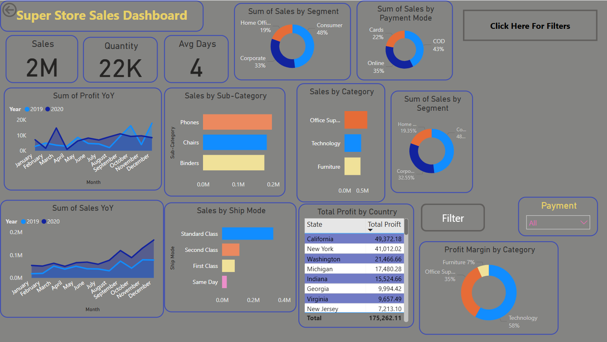
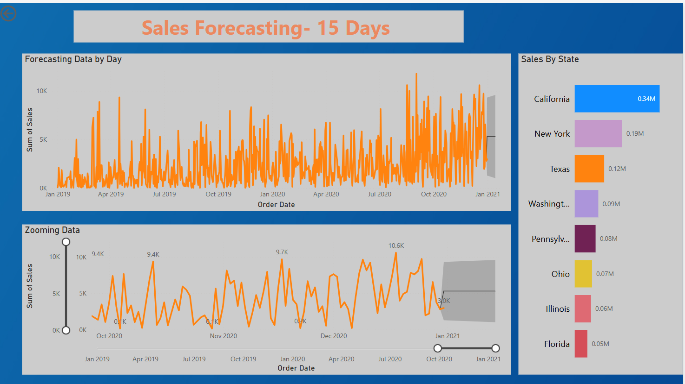

# 📊 Superstore Sales Analytics Dashboard - Power BI

This project showcases an interactive Power BI dashboard developed to analyze and visualize sales data from a Superstore dataset across the United States. It helps uncover insights about **sales trends**, **payment preferences**, **shipping methods**, **profitability**, and **forecasting future sales**.

---

## 🧾 Overview

The data consists of sales transactions from various U.S. states and includes attributes such as:
- Order date
- Sales amount
- Profit
- Ship mode
- Payment method
- Customer segment
- Product category and sub-category

The dashboard is designed to help businesses **understand performance trends**, **optimize shipping**, and **boost profit margins**.

---

## 📚 Dashboard Objectives

- Track and analyze **sales and profit performance** over time and across states
- Identify **top-performing categories, segments, and customer behaviors**
- Understand customer preferences for **payment modes and shipping methods**
- Provide **15-day sales forecasts** based on historical patterns
- Empower users with **interactive filtering** and **drill-through navigation**

---

## 📌 Key Features

- **Sales & Profit YOY Comparison**  
  Compare year-over-year trends to identify growth or loss patterns.

- **Sales Forecasting (15-Day Horizon)**  
  Time series forecasting implemented to predict upcoming sales behavior.

- **Dynamic Filtering and Drill-through**  
  Interactive slicers and drill-through capabilities for deeper insights.

- **Segment-wise & Category-wise Sales Analysis**  
  Visual breakdown of which segments and product categories drive revenue.

- **Payment Mode & Shipping Method Insights**  
  Analyze customer preferences by state to optimize logistics and payment methods.

- **Profit by Country Table**  
  Summary of total profit by U.S. states.

---

## 📈 Visuals Included

- Bar Charts  
  - Count of Payment Mode by State  
  - Count of Ship Mode by State  

- Line Charts  
  - Sum of Sales & Profit (YOY)  
  - Zoomed Sales Forecast over Time  

- Pie Charts  
  - Sales by Segment  
  - Sales by Payment Mode  
  - Profit Margin by Category  

- Matrix Table  
  - Total Profit by Country  

---

## 📅 Pages in the Dashboard

- **Home** – Introduction to the project and purpose.  
- **Data Analysis** – In-depth visuals and metrics.  
- **Forecast Data** – Sales predictions with historical trend comparison.  
- **Drill Through** – Detailed analysis on selected segments or regions.

---

## 📂 Dataset

The dashboard is powered by a cleaned version of the Superstore Sales dataset. Data was transformed within Power BI using Power Query for consistency and enhanced analytics.

---

## 🛠️ Tools & Technologies

- **Power BI Desktop**
- **Power Query**
- **DAX (Data Analysis Expressions)**
- **Superstore Sales Dataset (Kaggle)**

---

## 🧠 Insights Gained

- California is the highest contributing state by sales and profit.
- Standard Class is the most used shipping method.
- Technology category yields the highest profit margin.
- COD is the most common payment method.
- Sales show a seasonal pattern and are forecasted to rise in Q1 2021.

---

## 📸 Dashboard Preview

  
  
  
  

---

## 📃 License

This project is open-source and available under the [MIT License](LICENSE).

---

## 🙌 Acknowledgements

Special thanks to [Sample Superstore Dataset](https://www.kaggle.com/datasets) and Power BI for enabling rich data storytelling and visual analytics.
